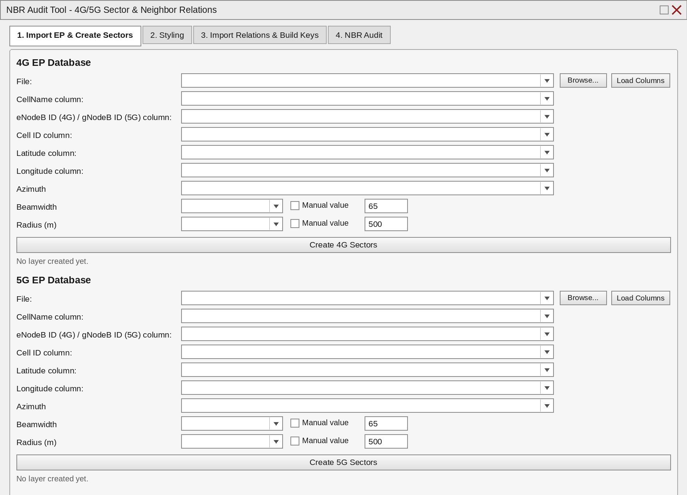
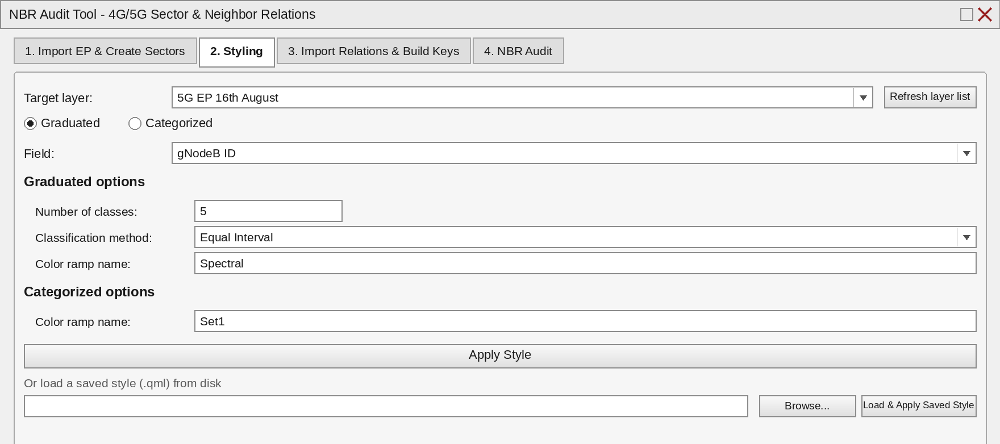
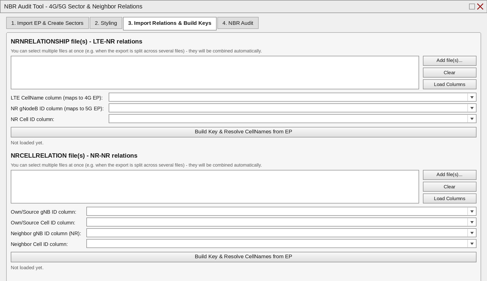
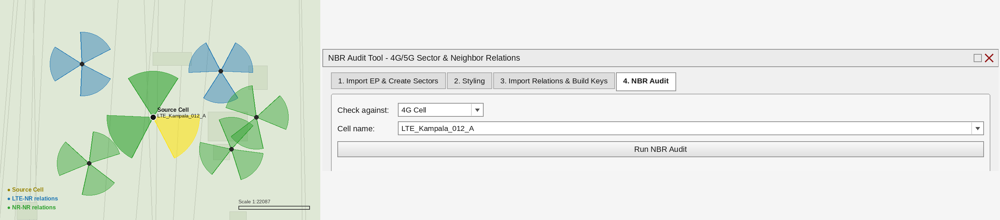

# NBR Audit Tool (QGIS Plugin)

A QGIS plugin for telecom RF/NPO teams to plot 4G/5G sectors from EP
(engineering parameter) exports, style them, and run LTE-NR / NR-NR
neighbor-relation audits — all from a dock panel inside QGIS.


See [CHANGELOG.md](CHANGELOG.md) for release history.

## What it does

- **Import EP & Create Sectors** — map your 4G/5G EP columns once
  (CellName, eNodeB/gNodeB ID, Cell ID, Lat/Lon, Azimuth, Beamwidth,
  Radius) and generate correctly oriented sector polygons for both
  networks.
- **Auto-Styling** — graduated or categorized styling by any field, in
  one click, or load a saved `.qml` style.
- **Import Relations & Build Keys** — drop in your `NRNRELATIONSHIP`
  (LTE-NR) and `NRCELLRELATION` (NR-NR) exports, even split across
  multiple files, and automatically build join keys and resolve cell
  names against your EP data.
- **NBR Audit** — pick a 4G or 5G cell, click **Run NBR Audit**, and see
  the source cell highlighted on the map alongside its LTE-NR and NR-NR
  neighbor relations as their own layers.

## Screenshots

| Import & Create Sectors | Auto-Styling |
|---|---|
|  |  |

| Import Relations & Build Keys | NBR Audit result |
|---|---|
|  |  |

## Installation

1. Copy the whole `nbr_audit_tool` folder into your QGIS profile's
   plugins directory:
   - **Windows**: `C:\Users\<you>\AppData\Roaming\QGIS\QGIS3\profiles\default\python\plugins\`
   - **macOS**: `~/Library/Application Support/QGIS/QGIS3/profiles/default/python/plugins/`
   - **Linux**: `~/.local/share/QGIS/QGIS3/profiles/default/python/plugins/`
2. Install the non-core dependencies into **QGIS's own Python** (see
   [requirements.txt](requirements.txt) for exact commands):
   ```
   pip install pandas openpyxl
   ```
   (`openpyxl` is only needed for reading `.xlsx` files.)
3. Restart QGIS, enable **NBR Audit Tool** in
   **Plugins ▸ Manage and Install Plugins ▸ Installed**, then launch it
   from the toolbar icon or **Plugins ▸ NBR Audit Tool**. It opens as a
   dock panel on the right side of the window — drag its border to
   resize, or drag its title bar to float/re-dock it.

## Workflow

### Tab 1 — Import EP & Create Sectors
- Browse to the 4G EP file and 5G EP file, click **Load Columns**.
- Map CellName, eNodeB ID/gNodeB ID, Cell ID, Latitude, Longitude,
  Azimuth.
- Beamwidth/Radius: from a column, or a manual fixed value.
- Click **Create 4G/5G Sectors**. Rows with bad data are skipped and
  reported in the status line rather than aborting the run; any genuine
  error (bad column mapping, non-numeric manual value, etc.) is shown in
  a message box with the underlying reason.
- A `Key` field (`<ID>_<CellID>`, normalized) is generated on every
  sector.

### Tab 2 — Styling
- Pick a layer, **Graduated** or **Categorized**, pick the field.
- Graduated: class count / classification method / color ramp name.
- Categorized: color ramp name (categories are auto-derived from the
  field's unique values).
- Or browse to a previously saved `.qml` style file and apply it
  directly.

### Tab 3 — Import Relations & Build Keys
- Import **NRNRELATIONSHIP** (LTE-NR) and **NRCELLRELATION** (NR-NR).
  **Add file(s)...** supports multi-select — add as many parts of the
  export as you need; they're concatenated automatically.
- **NRNRELATIONSHIP**: map the **LTE CellName column**, and the
  **NR gNodeB ID** / **NR Cell ID** columns (both references live on
  every row — see the RF logic note below). Clicking
  **Build Key & Resolve CellNames from EP**:
  1. Builds `NRKey` = NR gNodeB ID + NR Cell ID, resolved against the 5G
     EP `Key` to fill in `NRCellName` (for display/validation).
  2. Text-matches the LTE CellName column against the 4G EP CellName to
     resolve `LTEKey` (and keeps the name itself as `LTECellName`).
- **NRCELLRELATION**: map own gNB ID/Cell ID *and* neighbor gNB ID/Cell
  ID (both sides are NR cells, identified by IDs). Both `OwnKey` and
  `TargetKey` are resolved against the 5G EP by key.

### Tab 4 — NBR Audit
- Choose **4G Cell** or **5G Cell**; the cell-name box filters live as
  you type.
- **Run NBR Audit** adds a yellow **"Source Cell - <name>"** layer for
  the cell you searched, plus:
  - **4G cell selected** → own cell = the LTE CellName side (`LTEKey`
    matched to the chosen 4G cell); one output layer, **"LTE-NR
    relations"**, plots the NR-side (`NRKey`) cells from the matching
    rows.
  - **5G cell selected** → own cell = the NR gNodeB ID+Cell ID side
    (`NRKey` matched to the chosen 5G cell); two output layers:
    **"LTE-NR relations"** (the LTE-side `LTEKey` cells from the
    matching NRNRELATIONSHIP rows) and **"NR-NR relations"** (the
    neighbor NR cells from the matching NRCELLRELATION rows).
- Re-running the audit replaces its own output layers instead of piling
  up duplicates.

## RF logic note — why NRNRELATIONSHIP needs two keys

`NRNRELATIONSHIP` is a single relation table where **each row carries
both an LTE-side reference (CellName) and an NR-side reference (gNodeB
ID + Cell ID)** — there's no fixed "own vs. neighbor" column. Which one
is "own" and which is "neighbor" depends on which network type you're
auditing *from*:

- **Audit from a 4G cell**: the LTE CellName is the own cell (matched
  against 4G EP), and the NR gNodeB ID+Cell ID on that same row is the
  neighbor to plot (matched against 5G EP).
- **Audit from a 5G cell**: the NR gNodeB ID+Cell ID is the own cell
  (matched against 5G EP), and the LTE CellName on that same row is the
  neighbor to plot (matched against 4G EP).

`NRCELLRELATION` (NR-NR) is simpler — both sides are NR cells,
identified by IDs, with no ambiguity.

## Notes on the key/matching design

- If your `NRNRELATIONSHIP`/`NRCELLRELATION` export already contains a
  ready-made key column instead of separate ID/CellID columns, you can
  map the same column into both the ID and Cell ID drop-downs (Cell ID
  left blank isn't supported — use a constant placeholder column, or
  open an issue and a "single combined key column" option can be
  added).
- Matching is exact on the normalized key (uppercased, trimmed, trailing
  `.0` from Excel float-reads stripped) — no fuzzy text matching is
  involved, since relation files are ID-only.
- After building keys on Tab 3, if any mapping resolves less than half
  its rows, you'll get a pop-up telling you which mapping is suspect.
  This is a safety net, not a substitute for checking the drop-downs
  yourself — always confirm "NR Cell ID column" points at the real Cell
  ID column (e.g. `CellId`), not a local/sequence index column.

## Contributing

Issues and pull requests are welcome — see
[CONTRIBUTING.md](CONTRIBUTING.md).

## License

Licensed under the [GNU GPL v3](LICENSE).
